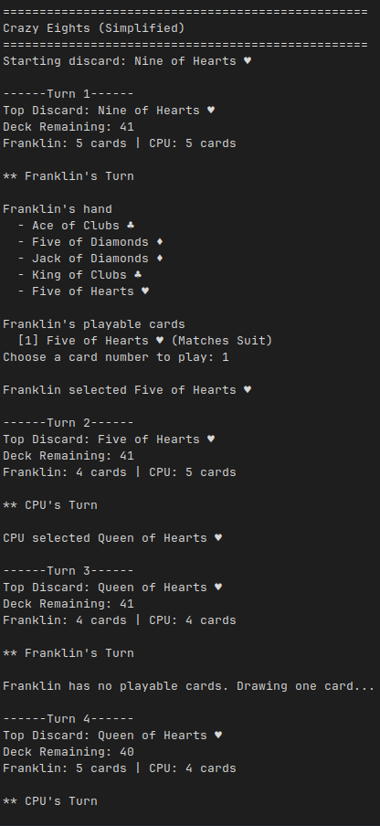

# Project Description: Crazy Eights

Console-based implementation of the Crazy Eights card game in C# (.NET 10).

## Game Rules

### Setup:

- Human Player vs Computer Player
- Standard 52-card deck
- Deal 5 cards to each player
- One card is placed face-up to start the discard pile

### On a turn:

A player may:

- Play one card that matches either:
  - the rank (the value on the card, e.g., 2, 7, 10, Jack, Queen, King, Ace), or
  - the suit (the symbol on the card: Clubs ♣, Diamonds ♦, Hearts ♥, Spades ♠)
  
  of the top discard card. 

  Example: If the top discard card is 7 of Hearts, you may play:
  - any 7 (7 of Clubs, 7 of Spades, etc.), or 
  - any Heart (2 of Hearts, King of Hearts, etc.).

- Eights are wild (Eights are CRAZY!)
  - An 8 may be played at any time, regardless of rank or suit 
  - When an 8 is played, the player declares a suit and the declared suit becomes the suit to match until a non-8 card is played. (e.g., “Hearts”), and the next player must match that suit

- If no playable card exists:
  - Draw one card 
  - If the drawn card is playable, it may be played immediately 
  - Otherwise, the turn ends

### Winning:

- The first player to empty their hand wins

## OO Concepts Demonstrated:

- Strategy Design Pattern
- Encapsulation
- Abstraction
- Polymorphism

## How to Run the Application (Console):

- The game is run via Docker to execute consistently across different environments.
  - Simply open your CLI and use the commands below:
  - ```bash```
    - ```docker build -t crazy-eights .```
    - ```docker run --rm -it crazy-eights```  
    - To exit game at any time: ```Ctrl + C```

## Screenshot of Game Play:

