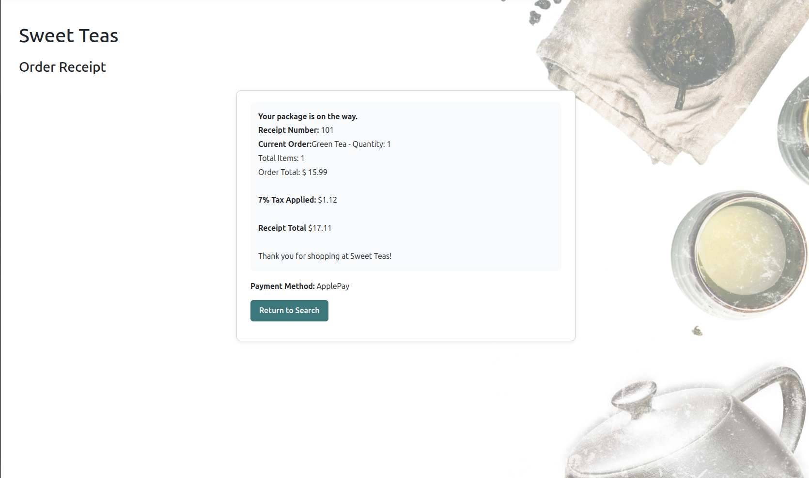

# TeaShoppe (MVC)


## 1. Project Description
Tea Shop MVC Web Application

This project evolves the console-based Tea Shop application from
Assignment 2 into a server-rendered MVC web application using
ASP.NET Core MVC and SOLID design principles.

### OOD Principles Used
#### Solid:
- Single Responsibility Principle (SRP)
- Open/Closed Principle (OCP)
- Liskov Substitution Principle (LSP)
- Interface Segregation Principle (ISP)
- Dependency Inversion Principle (DIP)
- Dependency Injection

#### Patterns: 
- Strategy (payment processing)
- Factory (strategy creation)
- Decorator (tea search filters)
- Singleton (repository managed by DI)

## 2. How to Run the Application
### Locally:
**Prerequisite:** .NET 10 SDK installed.
```bash
dotnet run --project TeaShoppe.Web/TeaShoppe.Web.csproj
```

### Docker:
**Prerequisite:** Docker Desktop / Docker Engine installed.

From the directory containing the Dockerfile:

```bash
docker build -t tea-shoppe-web .
docker run --rm -p 8080:8080 tea-shoppe-web
```
- To exit at any time:
  ```bash
  Ctrl + C
    ```
## 3. Screenshots




## 4. Validation

This version was validated through manual testing of the MVC workflow, including:

- Search and filter behavior
- Sorting behavior
- Successful checkout
- Invalid quantity handling
- Invalid payment input handling
- Inventory quantity decrease after purchase
- PRG flow after successful checkout