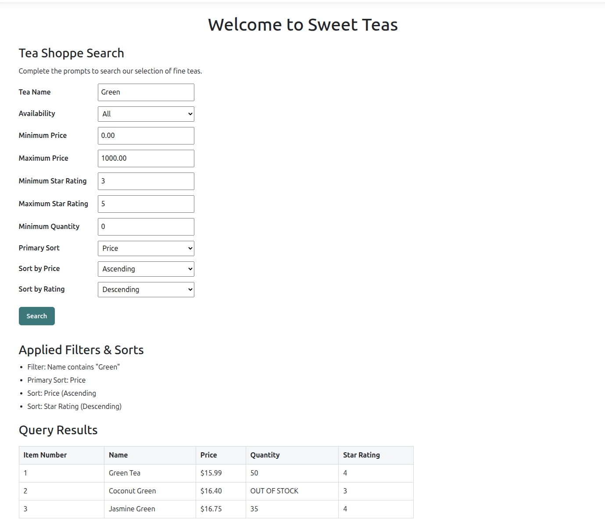
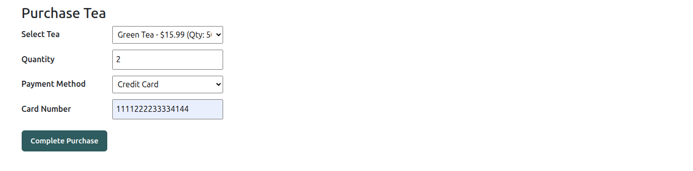

# TeaShoppe (MVC)

## 1. Project Description
Tea Shop MVC Web Application

This project evolves the console-based Tea Shop application from
Assignment 2 into a server-rendered MVC web application using
ASP.NET Core MVC and SOLID design principles.

### OOD Principles Used
- Single Responsibility Principle (SRP)
- Open/Closed Principle (OCP)
- Strategy Pattern (payment processing)
- Factory Pattern (strategy creation)
- Decorator Pattern (tea search filters)
- Encapsulation
- Polymorphism / Dynamic dispatch
- Dependency Injection

## 2. How to Run the Application
### Via Console
```bash
dotnet run --project TeaShoppe.Web/TeaShoppe.Web.csproj
```

### Via Docker
**Prerequisite:** Docker Desktop / Docker Engine installed.

From the repository root (the folder containing the `Dockerfile`):

```bash
docker build -t teashoppe .
docker run -it teashoppe
```
- To exit at any time:
  ```bash
  Ctrl + C
    ```
## 3. Screenshot




## 4. How to Run Tests

Run the automated unit tests using the .NET CLI.

From the repository root:

```bash
dotnet test TeaShoppe.Tests/TeaShoppe.Tests.csproj
