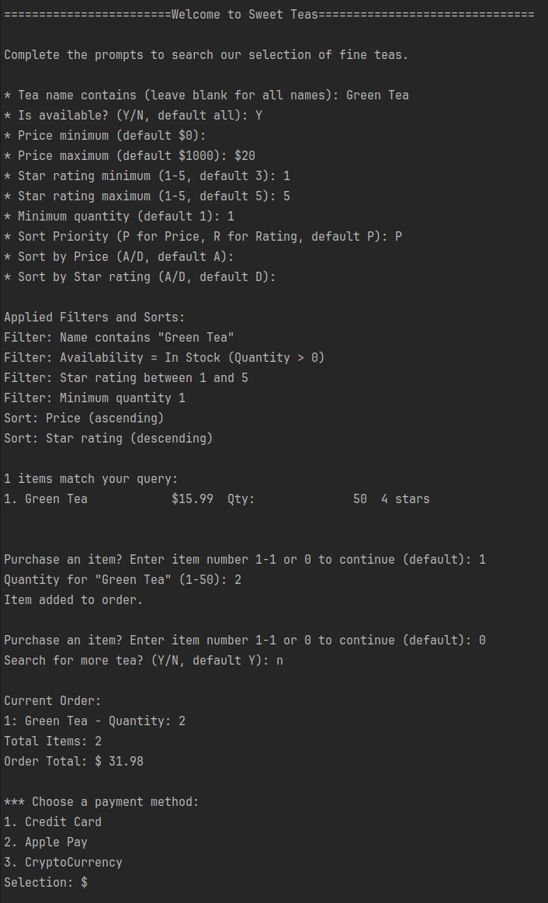
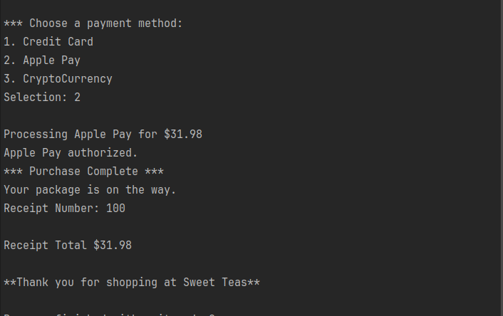

# TeaShoppe

## 1. Project Description
Console-based Tea Shoppe application that allows users to search, filter, sort, and purchase tea from an inventory.

### OOD Principles Used
- Single Responsibility Principle (SRP)
- Open/Closed Principle (OCP)
- Strategy Pattern (payment processing)
- Decorator Pattern (tea search filters)
- Encapsulation
- Polymorphism / dynamic dispatch

## 2. How to Run the Application
### Via Console
```bash
dotnet run --project TeaShoppe/TeaShoppe.csproj
```

### Via Docker
**Prerequisite:** Docker Desktop / Docker Engine installed.

From the repository root (the folder containing the `Dockerfile`):

```bash
docker build -t teashoppe .
docker run -it teashoppe
```
- To exit at any time:
  ```bash
  Ctrl + C
    ```
## 3. Screenshot




## 4. How to Run Tests

Run the automated unit tests using the .NET CLI.

From the repository root:

```bash
dotnet test TeaShoppe.Tests/TeaShoppe.Tests.csproj